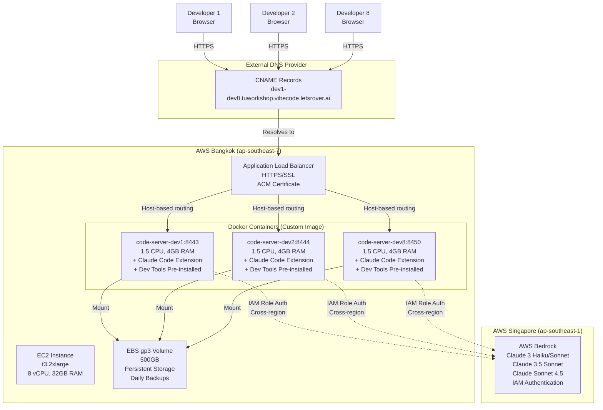

# AWS Code-Server Multi-Developer Platform with Bedrock Claude AI

Browser-based VS Code development environments for 8 developers on a single EC2 instance with AWS Bedrock Claude AI integration.

**Domain**: `tuworkshop.vibecode.letsrover.ai`
**Region**: Bangkok (ap-southeast-7) + Singapore (ap-southeast-1) for Bedrock
**Status**: ✅ Ready for deployment with Phase 1 improvements completed

---

## 🏗️ Architecture



### Key Features

**Infrastructure**:
- Single EC2 instance (t3.2xlarge) in Bangkok
- 8 isolated Docker containers with resource limits
- Application Load Balancer with SSL/TLS
- 500GB EBS volume with daily backups
- No Route53 required (manual CNAME setup)

**AI Integration**:
- AWS Bedrock in Singapore region
- IAM role-based authentication (no API keys)
- Multiple Claude models (Haiku, Sonnet, 3.5 Sonnet, Sonnet 4.5)
- Integrated via Claude Code extension

**Developer Experience** (Phase 1 Improvements ✅):
- Pre-installed development tools (tmux, htop, lsof)
- Node.js 20 LTS and Python 3.11 ready
- Common npm and pip packages pre-installed
- PM2 process manager
- Docker-in-Docker support
- Resource monitoring script
- Helper scripts for common tasks
- Port allocation guide

---

## 📚 Documentation

### Quick Start
- **[5-Minute Deployment Guide](cdk/QUICKSTART.md)** - Deploy infrastructure in 30 minutes
- **[CNAME Setup Guide](CNAME_SETUP.md)** - Configure DNS at your provider
- **[Deployment Summary](DEPLOYMENT_SUMMARY.md)** - Overview and architecture

### Configuration
- **[Claude Code Bedrock Setup](CLAUDE_CODE_BEDROCK_SETUP.md)** - Configure Claude extension
- **[Bedrock Usage Tracking](BEDROCK_USAGE_TRACKING.md)** - Monitor AI usage and costs

### Developer Experience
- **[Developer Journey](DEVELOPER_JOURNEY.md)** - Complete developer workflow guide
  - Onboarding (10 minutes)
  - Daily development workflow
  - Multiple projects workflow
  - Running local dev servers
- **[Improvements Completed](IMPROVEMENTS_COMPLETED.md)** - Phase 1 enhancements

### Product
- **[Press Release (English)](PRESS_RELEASE.md)** - Product overview
- **[Press Release (ไทย)](PRESS_RELEASE_TH.md)** - Product overview in Thai

### Technical
- **[Deployment Improvements](DEPLOYMENT_IMPROVEMENTS.md)** - Enhancement roadmap (Phase 1-3)
- **[CDK Documentation](cdk/README.md)** - Infrastructure as Code details

---

## 🚀 Quick Deploy

### Prerequisites
- Python 3.9+, Node.js 14+, AWS CLI v2, CDK 2.x
- AWS account with admin access
- Access to DNS provider (Cloudflare, GoDaddy, etc.)
- SSH key pair: `code-server-admin-key`

### Deploy in 5 Steps

```bash
# 1. Configure
cd cdk/
nano config/prod.py  # Set ADMIN_SSH_CIDR to your IP

# 2. Setup environment
python3 -m venv .venv
source .venv/bin/activate
pip install -r requirements.txt

# 3. Bootstrap CDK (one-time)
export AWS_ACCOUNT=$(aws sts get-caller-identity --query Account --output text)
cdk bootstrap aws://$AWS_ACCOUNT/ap-southeast-7

# 4. Deploy all stacks
cdk deploy --all

# 5. Setup DNS (see CNAME_SETUP.md for detailed instructions)
# - Get ALB DNS name from outputs
# - Add certificate validation CNAME at DNS provider
# - Add developer subdomain CNAMEs (dev1-dev8) at DNS provider
# - Wait for DNS propagation (5-60 minutes)
```

### Post-Deployment

```bash
# Enable Bedrock model access (REQUIRED)
# Go to: https://ap-southeast-1.console.aws.amazon.com/bedrock/
# Enable: Claude 3 Haiku, Sonnet, 3.5 Sonnet, Sonnet 4.5

# Start containers on EC2
ssh -i ~/.ssh/code-server-admin-key.pem ubuntu@$INSTANCE_IP
cd /home/ubuntu
docker-compose up -d

# Access developer environments
# https://dev1.tuworkshop.vibecode.letsrover.ai
# https://dev2.tuworkshop.vibecode.letsrover.ai
# ... (dev3-dev8)
```

---

## 💰 Cost Estimate

**Infrastructure**: ~$420-450/month for 8 developers in Bangkok

| Resource | Cost/Month | Notes |
|----------|------------|-------|
| EC2 t3.2xlarge | ~$273 | 8 vCPU, 32GB RAM, Bangkok |
| EBS gp3 500GB | ~$48 | Data volume with backups |
| ALB | ~$27 | Application Load Balancer |
| CloudWatch, Backup | ~$70 | Monitoring and daily backups |
| **Subtotal** | **~$418** | Per 8 developers (~$52/dev) |

**AWS Bedrock (Claude AI)**: Variable based on usage

| Usage Level | Tokens/Dev/Month | Cost/Dev | Total (8 devs) |
|-------------|------------------|----------|----------------|
| Light | 1M tokens | ~$18 | ~$144 |
| Medium | 10M tokens | ~$180 | ~$1,440 |
| Heavy | 50M tokens | ~$900 | ~$7,200 |

**Cross-region data transfer** (Bangkok → Singapore): ~$5-20/month

**Total estimated cost**: $570-$8,000/month (infrastructure + AI usage)

💡 **Save 21-32% with Reserved Instances** (infrastructure only)

---

## ✨ What's New - Phase 1 Improvements

Recent enhancements (completed 2025-01-19):

### Custom Docker Image
- Pre-installed: tmux, htop, lsof, net-tools
- Node.js 20 LTS + Python 3.11
- npm packages: pm2, typescript, nodemon, etc.
- pip packages: fastapi, uvicorn, pytest, etc.
- Docker-in-Docker support
- Shell aliases and colored prompt

### Resource Monitoring
- `monitor-resources.sh` - One-command resource overview
- Shows container CPU/memory, disk usage, open ports
- Top processes by memory

### Helper Scripts
- `check-ports.sh` - View all open ports
- `stop-all-servers.sh` - Stop all dev servers
- `switch-project.sh` - Switch between projects with context

### Port Allocation Guide
- Documented port ranges for different services
- Frontend: 3000-3099
- Backend: 4000-4099, 8000-8099
- Databases: 5432 (PostgreSQL), 6379 (Redis)

**Developer setup time reduced from 30-60 minutes to 5-10 minutes!**

See [IMPROVEMENTS_COMPLETED.md](IMPROVEMENTS_COMPLETED.md) for details.

---

## 🎯 Key Features

### For Developers
- ✅ Browser-based VS Code (no local installation)
- ✅ Persistent workspace (survives container restarts)
- ✅ AWS Bedrock Claude AI (no API key management)
- ✅ Full Linux environment with sudo access
- ✅ Development tools pre-installed (Phase 1)
- ✅ Resource monitoring and helper scripts
- ✅ Multi-project workflow support
- ✅ Port forwarding for local dev servers

### For Administrators
- ✅ Infrastructure as Code (AWS CDK Python)
- ✅ One-command deployment
- ✅ Centralized user management (Secrets Manager)
- ✅ Resource monitoring (CloudWatch)
- ✅ Daily automated backups
- ✅ Cost-effective (~$52/developer/month)
- ✅ Scales to 8 developers on single instance

### For Organizations
- ✅ No Route53 required (use existing DNS provider)
- ✅ IAM-based Bedrock auth (no API key sprawl)
- ✅ Cross-region setup (Bangkok + Singapore)
- ✅ SSL/TLS encryption
- ✅ Isolated development environments
- ✅ CloudWatch logging and metrics
- ✅ Working Backwards documentation

---

## 🔒 Security Features

- IAM role-based authentication (no API keys)
- SSL/TLS via AWS Certificate Manager
- Security groups restrict network access
- Secrets Manager for password storage
- Container isolation with resource limits
- Daily EBS volume snapshots
- CloudWatch logging and monitoring
- Admin SSH access restricted by IP

---

## 📊 Resource Allocation

**Per Developer Container**:
- 1.5 CPU cores (limit)
- 4GB RAM (limit)
- Dedicated workspace directory
- Dedicated config directory
- Port forwarding support

**EC2 Instance** (t3.2xlarge):
- 8 vCPU, 32GB RAM
- 50GB root EBS (gp3)
- 500GB data EBS (gp3)
- Public IP with Elastic IP option

---

## 🛠️ Tech Stack

**Infrastructure**:
- AWS CDK (Python)
- AWS EC2, EBS, ALB
- AWS Certificate Manager
- AWS Secrets Manager
- AWS CloudWatch

**Containerization**:
- Docker
- Docker Compose
- code-server (browser VS Code)

**AI Platform**:
- AWS Bedrock
- Claude 3 models (Haiku, Sonnet, 3.5, 4.5)

**Development Tools** (Phase 1):
- Node.js 20 LTS, Python 3.11
- tmux, htop, lsof, PM2
- Docker-in-Docker
- Helper scripts and monitoring

---

## 📖 Documentation Index

| Document | Purpose | Status |
|----------|---------|--------|
| [README.md](README.md) | Project overview (this file) | ✅ Current |
| [QUICKSTART.md](cdk/QUICKSTART.md) | 5-minute deployment | ✅ Ready |
| [CNAME_SETUP.md](CNAME_SETUP.md) | DNS configuration | ✅ Ready |
| [DEPLOYMENT_SUMMARY.md](DEPLOYMENT_SUMMARY.md) | Architecture overview | ✅ Ready |
| [CLAUDE_CODE_BEDROCK_SETUP.md](CLAUDE_CODE_BEDROCK_SETUP.md) | Claude extension config | ✅ Ready |
| [BEDROCK_USAGE_TRACKING.md](BEDROCK_USAGE_TRACKING.md) | Usage monitoring | ✅ Ready |
| [DEVELOPER_JOURNEY.md](DEVELOPER_JOURNEY.md) | Developer workflow | ✅ Updated |
| [IMPROVEMENTS_COMPLETED.md](IMPROVEMENTS_COMPLETED.md) | Phase 1 enhancements | ✅ Complete |
| [DEPLOYMENT_IMPROVEMENTS.md](DEPLOYMENT_IMPROVEMENTS.md) | Enhancement roadmap | ✅ Phase 1 done |
| [PRESS_RELEASE.md](PRESS_RELEASE.md) | Product overview (EN) | ✅ Ready |
| [PRESS_RELEASE_TH.md](PRESS_RELEASE_TH.md) | Product overview (TH) | ✅ Ready |

---

## 🚦 Deployment Status

- ✅ Phase 1 Improvements: **Complete**
  - Custom Docker image with dev tools
  - Resource monitoring script
  - Helper scripts
  - Port allocation guide

- ⏳ Documentation Review: **In Progress**

- ⏳ Ready for Deployment: **Pending approval**

---

## 🤝 Support

### Troubleshooting
- Check [CNAME_SETUP.md](CNAME_SETUP.md#troubleshooting) for DNS issues
- Check [QUICKSTART.md](cdk/QUICKSTART.md#troubleshooting) for deployment issues
- View logs: `docker logs code-server-devN`
- Monitor resources: `./monitor-resources.sh`

### Getting Help
- Review documentation in this repository
- Check AWS Certificate Manager for certificate status
- Verify DNS propagation with `dig` command
- Check CloudWatch Logs for errors

---

## 📅 Changelog

**2025-01-19**:
- ✅ Phase 1 improvements completed
- ✅ Custom Docker image with development tools
- ✅ Resource monitoring and helper scripts
- ✅ Port allocation documentation
- ✅ Updated all documentation for consistency

**2025-01-19** (Earlier):
- ✅ Switched from Route53 to CNAME approach
- ✅ Created CertificateStack (manual DNS validation)
- ✅ Added comprehensive CNAME setup guide
- ✅ Updated developer journey with multi-project workflows

**2025-01-19** (Initial):
- ✅ Complete CDK implementation (6 stacks)
- ✅ Bedrock integration with IAM authentication
- ✅ Bangkok region deployment (cross-region Bedrock)
- ✅ Comprehensive documentation suite

---

## 📜 License

This project is for internal use. AWS resources will incur costs.

---

**Ready to deploy?**

1. Read [QUICKSTART.md](cdk/QUICKSTART.md)
2. Check [IMPROVEMENTS_COMPLETED.md](IMPROVEMENTS_COMPLETED.md)
3. Follow [CNAME_SETUP.md](CNAME_SETUP.md)
4. Configure [CLAUDE_CODE_BEDROCK_SETUP.md](CLAUDE_CODE_BEDROCK_SETUP.md)

**Questions?** Review the documentation or check the troubleshooting sections.

---

**Built with AWS CDK + Docker + Bedrock Claude AI**
**Deployment Region**: Bangkok (ap-southeast-7)
**AI Region**: Singapore (ap-southeast-1)
**Last Updated**: 2025-01-19
